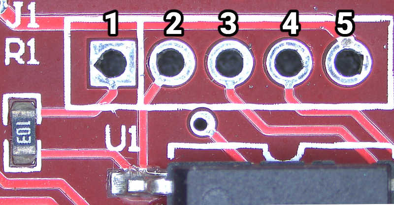

# pcProx disassembly

This document describes the (physical) internals of the pcProx RFID readers.

This document comes from [Python pcprox library][0].  It is not an official
document, and not written or endorsed by RFIDeas.  It is written in the hope
that it can be useful.

This documentation was written for the following models:

* RDR-6081AKU / RDR-6081APU (125kHz HID Prox Desktop USB reader)

## Opening

There appear to be no screws in the case.  The rubber feet and stickers can stay
on the case when opening.

The case is held together by friction, with four poles on the "top" of the case
which go into sockets on the "base" of the case:

* Two are located on either side of the cord, approximately half way between the
  cord and the edge of the case, near the edge.
  
* Two are located on the left and right edges of the device, about half way down

Take care when opening, as the antenna coil is loose and may be pulled off when
opening the case, requiring resoldering.

Otherwise the case can be pushed open from the side opposite the cord with
either a flat-head screwdriver or a guitar pick.

## Major components

* [Microchip PIC18F2450][PIC18F2450] single-chip microcontroller
* [HID eProx MCM 4025][4025] multi-chip OEM reader module
* Antenna coil
* Red LED
* Green LED
* Piezo-electric buzzer

### PIC18F2450

The [PIC18F2450][PIC18F2450] controls the USB connection, and drives the HID eProx
module.

A header for ["high voltage" programming][pic18f-pgm] is exposed at connector
`J1`:

1. (square): `Vdd`
2. `MCLR` (has 10k resistor to `Vdd`)
3. `PGC`
4. `PGD`
5. `GND`

This can be attached to a PIC programmer, such as a PICkit2 compatible
programmer that supports ICSP (in-circuit system programming). The device has
the code-protect bits set on all parts of memory, making it more difficult to
dump.

[Heart of Darkness][heart-of-darkness] describes a method for dumping PIC
microcontrollers by using _two_ identically-programmed PICs:

* In the first device, overwrite the boot block with a dumper which emits all
  program blocks.

* In the second device, overwrite program blocks with `NOP` instructions, and
  place a boot block dumper at the end of the last block. When the bootloader
  jumps into any location in the program blocks, the processor will slide down
  the `NOP`s until it reaches the dumper.

From there the two dumps can be merged, the code-protect bits can be disabled,
and it would enable on-device debugging as well.

There is some firmware published online which is supposedly in "HEX" format
(used by the official flashing tool), but these files do not appear to be in
standard Intel HEX format.

TODO: The firmware update tool has a way to jump into the boot block to enable
reprogramming.

[0]: https://github.com/micolous/pcprox
[PIC18F2450]: https://www.microchip.com/wwwproducts/en/PIC18F2450
[pic18f-pgm]: http://ww1.microchip.com/downloads/en/DeviceDoc/30009622M.pdf
[4025]: https://www.hidglobal.com/products/embedded-modules/hid-proximity/4025
[heart-of-darkness]: https://www.openpcd.org/images/HID-iCLASS-security.pdf
